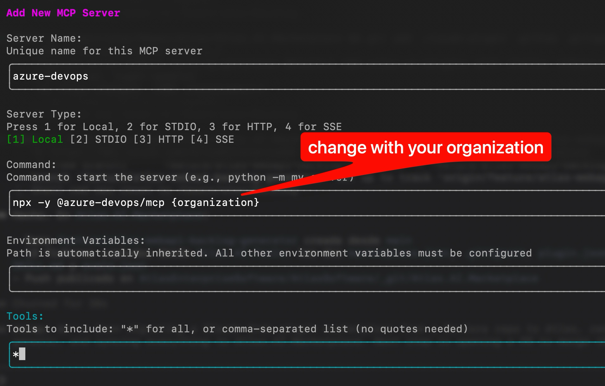

# Atlas.AI.Marketplace

Plugin marketplace for GitHub Copilot CLI and Claude Code — [Atlas Development team](https://www.atlassoftware.es/).

## Dependencies to install

> Install in the order listed — Node is required before the MCP step.

### Node

Required to run `npx`, which is used to launch the Azure DevOps MCP server.

```bash
winget install -e --id OpenJS.NodeJS
```

### Azure CLI

Base CLI used to manage Azure resources and extensions.

```bash
winget install --exact --id Microsoft.AzureCLI
```

### Azure DevOps Extension for Azure CLI

Adds `az devops` commands. Run both to ensure the latest version is installed.

```bash
az extension add --name azure-devops
```
Adds `az application-insights` commands. Run both to ensure the latest version is installed.

```bash
az extension add --name application-insights
```

Adds `az log-analytics` commands. Run both to ensure the latest version is installed.
```bash
az extension add --name log-analytics
```

#### Update extension

```bash
az extension update --name azure-devops
```

### Azure DevOps MCP

Registers the Azure DevOps MCP server so AI assistants can call Azure DevOps APIs.

#### Claude Code

```bash
claude mcp add --scope user azure-devops -- npx -y @azure-devops/mcp {organization}
```

#### Copilot CLI

Inside an interactive Copilot CLI session, run:

```
/mcp add
```




## Available Plugins

| Plugin | Version | Description |
|--------|---------|-------------|
| `atlas-ai-plugins` | 1.7.0 | Skills, agents, commands, and hooks for the Atlas Development team |

### Skills included

| Skill | Description |
|-------|-------------|
| `atlas-azure-devops-pr` | Standardizes PR creation for Atlas repositories hosted in Azure DevOps |
| `atlas-appinsights-failures` | Standardizes failure tracking for Atlas Azure Resources using Azure Application Insights |
| `atlas-nuget-updater` | Automates NuGet package updates for one or more .NET solutions, verifies build and tests, and creates a PR |
| `atlas-webapi-backlog-generator` | Generates a full Azure DevOps backlog for a new .NET Web API following Atlas Clean Architecture |
| `atlas-blazor-new-page` | Generates an Azure DevOps backlog for adding a new page or view to an existing Blazor module |
| `atlas-blazor-grid-page` | Generates an Azure DevOps backlog for adding a TelerikGrid listing page with full BFF integration flow |
| `atlas-blazor-side-panel-editor` | Generates an Azure DevOps backlog for adding create/edit/delete via a lateral side panel editor |
| `atlas-blazor-new-component` | Generates an Azure DevOps backlog for adding a new reusable Blazor component (with or without backend data) |
| `atlas-blazor-new-module` | Generates an Azure DevOps backlog for scaffolding a complete new Blazor feature module from scratch |

### Agents included

| Agent | Description |
|-------|-------------|
| `planner` | Turns a feature request into an implementation spec (`.pipeline/spec.md`). First stage of the feature pipeline |
| `coder` | Implements the spec, writing a change summary to `.pipeline/changes.md`. Second stage |
| `tester` | Writes and runs tests for the changes, reporting to `.pipeline/test-results.md`. Third stage |
| `reviewer` | Read-only final review against spec, changes, and tests, producing a verdict in `.pipeline/review.md`. Fourth stage |

### Commands included

| Command | Description |
|---------|-------------|
| `/ship` | Runs the full feature pipeline (planner → coder → tester → reviewer) |
| `/pr` | Opens or updates an Azure DevOps PR via the `atlas-azure-devops-pr` skill — never commits |

## Installation

### GitHub Copilot CLI

#### 1. Register the marketplace (one time only)

```bash
copilot plugin marketplace add https://github.com/Atlas-Enterprise-Software/atlas-ai.git
```

#### 2. Install the plugin

```bash
copilot plugin install atlas-ai-plugins@atlas-ai-marketplace
```

#### 3. Verify the installation

```bash
copilot plugin list
```

Or within an interactive Copilot CLI session:

```
/plugin list
/skills list
```

### Claude Code

#### 1. Register the marketplace (one time only)

```bash
claude plugin marketplace add https://github.com/Atlas-Enterprise-Software/atlas-ai.git
```

#### 2. Install the plugin

```bash
claude plugin install atlas-ai-plugins@atlas-ai-marketplace
```

#### 3. Verify the installation

```bash
claude plugin list
```

Or within a Claude Code session:

```
/plugin list
/skills list
```

## Update

When the plugin has been updated in this repository, run:

**Copilot CLI:**
```bash
copilot plugin update atlas-ai-plugins
```

**Claude Code:**
```bash
claude plugin update atlas-ai-plugins
```

## Browse available plugins

**Copilot CLI:**
```bash
copilot plugin marketplace browse atlas-ai-marketplace
```

**Claude Code:**
```bash
claude plugin marketplace browse atlas-ai-marketplace
```

## Repository structure

```
ATLAS.AI.MARKETPLACE/
├── .claude-plugin/
│   └── marketplace.json                  # Marketplace registry (Claude Code)
├── plugins/
│   └── atlas-ai-plugins/          # Plugin: atlas-ai-plugins
│       ├── .claude-plugin/
│       │   └── plugin.json               # Plugin manifest (Claude Code)
│       ├── plugin.json                   # Plugin manifest (Copilot CLI)
│       ├── skills/
│       │   └── atlas-azure-devops-pr/  # Skill: Azure DevOps PR workflow
│       │       └── SKILL.md              # Shared across all platforms
│       ├── agents/                       # Custom subagents (planner, coder, tester, reviewer)
│       ├── commands/                     # Slash commands (/ship, /pr)
│       └── hooks/                        # Lifecycle hooks (future)
└── README.md
```

## Adding components to the plugin

> **Version bump required?** Any change that users should pick up requires bumping the version in `plugin.json` and `marketplace.json` and notifying the team. See [Versioning](#versioning).

### Adding a new skill

1. Create a folder at `plugins/atlas-ai-plugins/skills/<skill-name>/`
2. Add a `SKILL.md` file with YAML frontmatter and Markdown instructions:

   ```markdown
   ---
   name: my-new-skill
   description: "When to use this skill."
   version: 1.0.0
   author: Your Name
   ---

   # my-new-skill

   Instructions for Copilot go here...
   ```

3. Optionally add scripts or resources in the same folder
4. Add a row to the **Skills included** table in this README
5. Bump `version` in `plugin.json` and `marketplace.json` (minor bump: `1.0.0` → `1.1.0`)
6. Commit and push to `main`
7. Notify the team to run `copilot plugin update atlas-ai-plugins` (Copilot CLI) or `claude plugin update atlas-ai-plugins` (Claude Code)

### Modifying an existing skill

1. Edit the `SKILL.md` (and any supporting files) inside `plugins/atlas-ai-plugins/skills/<skill-name>/`
2. Bump `version` inside the `SKILL.md` frontmatter (patch: `1.0.0` → `1.0.1`)
3. Bump `version` in `plugin.json` and `marketplace.json` (patch: `1.0.0` → `1.0.1`)
4. Commit and push to `main`
5. Notify the team to run `copilot plugin update atlas-ai-plugins` (Copilot CLI) or `claude plugin update atlas-ai-plugins` (Claude Code)

### Adding a new custom agent

1. Create a Markdown file at `plugins/atlas-ai-plugins/agents/<agent-name>.md`
2. Include YAML frontmatter and the agent profile:

   ```markdown
   ---
   name: my-agent
   description: "What this agent specializes in."
   tools: [view, grep, glob, edit]
   infer: true
   ---

   # my-agent

   You are a specialist in...
   ```

3. Bump `version` in `plugin.json` and `marketplace.json` (minor bump: `1.0.0` → `1.1.0`)
4. Commit and push to `main`
5. Notify the team to run `copilot plugin update atlas-ai-plugins` (Copilot CLI) or `claude plugin update atlas-ai-plugins` (Claude Code)

### Modifying an existing agent

1. Edit the agent `.md` file inside `plugins/atlas-ai-plugins/agents/`
2. Bump `version` in `plugin.json` and `marketplace.json` (patch: `1.0.0` → `1.0.1`)
3. Commit and push to `main`
4. Notify the team to run `copilot plugin update atlas-ai-plugins` (Copilot CLI) or `claude plugin update atlas-ai-plugins` (Claude Code)

### Adding a new command

1. Create a Markdown file at `plugins/atlas-ai-plugins/commands/<command-name>.md` (the file name becomes the slash command, e.g. `ship.md` → `/ship`)
2. Include YAML frontmatter and the prompt body:

   ```markdown
   ---
   description: "One-line summary shown in the command list."
   argument-hint: <what to pass after the command>
   ---

   Prompt for the model. Use $ARGUMENTS to inject what the user typed.
   ```

3. Bump `version` in `plugin.json` and `marketplace.json` (minor bump: `1.0.0` → `1.1.0`)
4. Commit and push to `main`
5. Notify the team to run `copilot plugin update atlas-ai-plugins` (Copilot CLI) or `claude plugin update atlas-ai-plugins` (Claude Code)

### Modifying an existing command

1. Edit the command `.md` file inside `plugins/atlas-ai-plugins/commands/`
2. Bump `version` in `plugin.json` and `marketplace.json` (patch: `1.0.0` → `1.0.1`)
3. Commit and push to `main`
4. Notify the team to run `copilot plugin update atlas-ai-plugins` (Copilot CLI) or `claude plugin update atlas-ai-plugins` (Claude Code)

### Adding a new hook

1. Create the hook script in `plugins/atlas-ai-plugins/hooks/`
2. Name it after the lifecycle event (e.g. `preToolUse.sh`, `sessionStart.sh`, `postToolUse.sh`)
3. Available lifecycle events: `preToolUse`, `postToolUse`, `userPromptSubmitted`, `sessionStart`, `sessionEnd`, `errorOccurred`, `agentStop`, `subagentStop`
4. Bump `version` in `plugin.json` and `marketplace.json` (minor bump: `1.0.0` → `1.1.0`)
5. Commit and push to `main`
6. Notify the team to run `copilot plugin update atlas-ai-plugins` (Copilot CLI) or `claude plugin update atlas-ai-plugins` (Claude Code)

### Modifying an existing hook

1. Edit the hook script inside `plugins/atlas-ai-plugins/hooks/`
2. Bump `version` in `plugin.json` and `marketplace.json` (patch: `1.0.0` → `1.0.1`)
3. Commit and push to `main`
4. Notify the team to run `copilot plugin update atlas-ai-plugins` (Copilot CLI) or `claude plugin update atlas-ai-plugins` (Claude Code)

## Versioning

This plugin uses [Semantic Versioning](https://semver.org/) (`MAJOR.MINOR.PATCH`).

| Change | Version bump | Example |
|--------|-------------|---------|
| Fix or improvement to an existing skill, agent, or hook | **Patch** | `1.0.0` → `1.0.1` |
| New skill, agent, or hook added | **Minor** | `1.0.0` → `1.1.0` |
| Skill, agent, or hook removed or renamed (breaking) | **Major** | `1.0.0` → `2.0.0` |
| Docs-only change (README, comments) — no functional change | **No bump needed** | — |

Always bump the version in **both** of these files together:

- `plugins/atlas-ai-plugins/plugin.json`
- `.github/plugin/marketplace.json`

When modifying a specific skill, also bump its own `version` field inside its `SKILL.md` frontmatter.

## For maintainers: how to publish an update

1. Edit or add components under `plugins/atlas-ai-plugins/`
2. Bump the `version` field in both `plugins/atlas-ai-plugins/plugin.json` and `.github/plugin/marketplace.json`
3. If a skill was modified, also bump its `version` inside the `SKILL.md` frontmatter
4. If a new skill was added, add a row to the **Skills included** table in this README
5. Commit and push to `main`
6. Notify the team to run `copilot plugin update atlas-ai-plugins` (Copilot CLI) or `claude plugin update atlas-ai-plugins` (Claude Code)

## About Atlas

[Atlas Enterprise Software](https://www.atlassoftware.es/) is a technology consultancy specializing in Azure, .NET, and applied AI. We build modern cloud architectures and AI-powered tooling for enterprise systems — this marketplace is part of our internal developer platform, released as open source.
