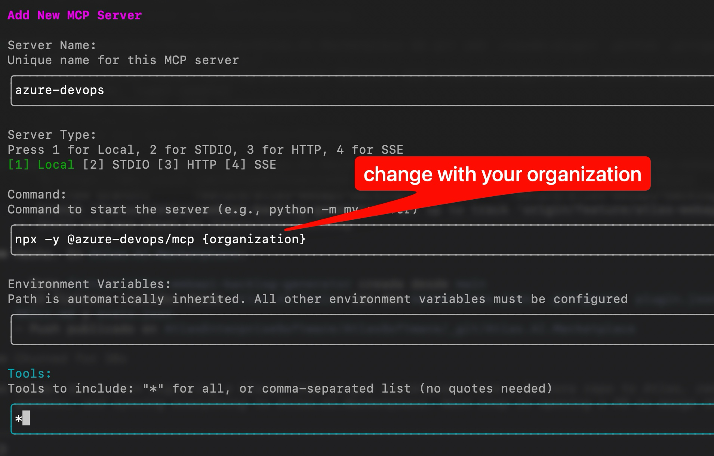

# Atlas.AI.Marketplace

Plugin marketplace for GitHub Copilot CLI and Claude Code — [Atlas Development team](https://www.atlassoftware.es/).

## Dependencies to install

> Install in the order listed — Node is required before the MCP step.

### Node

Required to run `npx`, which is used to launch the Azure DevOps MCP server.

```bash
winget install -e --id OpenJS.NodeJS
```

### Azure CLI

Base CLI used to manage Azure resources and extensions.

```bash
winget install --exact --id Microsoft.AzureCLI
```

### Azure DevOps Extension for Azure CLI

Adds `az devops` commands. Run both to ensure the latest version is installed.

```bash
az extension add --name azure-devops
```
Adds `az application-insights` commands. Run both to ensure the latest version is installed.

```bash
az extension add --name application-insights
```

Adds `az log-analytics` commands. Run both to ensure the latest version is installed.
```bash
az extension add --name log-analytics
```

#### Update extension

```bash
az extension update --name azure-devops
```

### Azure DevOps MCP

Registers the Azure DevOps MCP server so AI assistants can call Azure DevOps APIs.

#### Claude Code

```bash
claude mcp add --scope user azure-devops -- npx -y @azure-devops/mcp {organization}
```

#### Copilot CLI

Inside an interactive Copilot CLI session, run:

```
/mcp add
```




## Available Plugins

| Plugin | Version | Description |
|--------|---------|-------------|
| `atlas-ai-plugins` | 2.2.0 | Skills, agents, commands, and hooks for the Atlas Development team |

### Skills included

| Skill | Description |
|-------|-------------|
| `atlas-pr-platform` | The pull-request layer for Atlas repositories, platform-agnostic behind an adapter contract — Azure DevOps today, one file per platform to add more. Creates and updates PRs, and reads and answers review comments |
| `atlas-appinsights-failures` | Standardizes failure tracking for Atlas Azure Resources using Azure Application Insights |
| `atlas-nuget-updater` | Automates NuGet package updates for one or more .NET solutions, verifies build and tests, and creates a PR |
| `atlas-webapi-backlog-generator` | Generates a full Azure DevOps backlog for a new .NET Web API following Atlas Clean Architecture |
| `atlas-blazor-new-page` | Generates an Azure DevOps backlog for adding a new page or view to an existing Blazor module |
| `atlas-blazor-grid-page` | Generates an Azure DevOps backlog for adding a TelerikGrid listing page with full BFF integration flow |
| `atlas-blazor-side-panel-editor` | Generates an Azure DevOps backlog for adding create/edit/delete via a lateral side panel editor |
| `atlas-blazor-new-component` | Generates an Azure DevOps backlog for adding a new reusable Blazor component (with or without backend data) |
| `atlas-blazor-new-module` | Generates an Azure DevOps backlog for scaffolding a complete new Blazor feature module from scratch |

### Agents included

| Agent | Description |
|-------|-------------|
| `planner` | Turns a feature request into an implementation spec (`.ship/spec.md`). First stage of the feature pipeline |
| `coder` | Implements the spec, writing a change summary to `.ship/changes.md`. Second stage |
| `tester` | Writes and runs tests for the changes, reporting to `.ship/test-results.md`. Third stage |
| `reviewer` | Read-only review against spec, changes, and tests, producing a verdict in `.ship/review.md`. Fourth and last stage |
| `pr-feedback` | Reads the unresolved review comments on the current branch's open PR — on any supported platform — and turns them into an actionable fix list in `.ship/pr-feedback.md` |

> **Note:** When a feature request is ambiguous, the `planner` agent uses the **grill-me** skill to interrogate the request before writing the spec. **grill-me** is an external, optional skill — it is not bundled in this plugin and must be installed separately. The planner guards the step with an "if available" check, so the pipeline degrades gracefully when **grill-me** isn't installed.

### How the commands run

The main conversation walks the stages: each command is a short sequence it drives directly, delegating one specialist at a time and confirming that stage's handoff file before starting the next.

| Command | Flow |
|---------|------|
| `/ship <request>` | `planner` → `coder` → `tester` → `reviewer`, in order. Each stage's handoff file under `.ship/` is confirmed to exist before the next one starts. The spec's OPEN QUESTIONS stop the run and come to you; so do failing tests |
| `/address-pr` | `pr-feedback` and stop. It reads the unresolved threads and writes the fix list to `.ship/pr-feedback.md`; **you** decide what gets fixed, and the fixes happen in the conversation. Answering a review isn't implementing a request, so it stays a separate command rather than a `/ship` flag |

Two guarantees are worth stating plainly, because they are the ones that cost something if they slip:

- **No unapproved side effects.** Nothing commits, pushes, or merges — not at the end, not "to keep the branch tidy". Nothing is posted to a hosting platform (a reply, a thread resolution, even marking a thread fixed) until you have approved the *exact text*. Approving one action never covers the next. Turning the finished branch into a PR stays a separate, human-triggered step: `/raise-pr`.
- **Review rounds come from the PR, not from a local file.** A thread you already answered that the reviewer reopened — by status or by citing it from a later comment — is reported as `REOPENED (round N)`, first on the list, carrying your previous reply and their new objection. On round 3 it is handed to you rather than guessed at a third time: two fixes have already missed the point. Because the count is derived from the PR's own comment history, **nothing has to survive between runs** and `.ship/` stays disposable.

### Platform support

Nothing in the plugin hardcodes a hosting platform. Platform knowledge lives in exactly one place — the `atlas-pr-platform` skill — behind an **operation contract**:

```
agents/            planner, coder, tester, reviewer                 ← pure git, no platform at all
                   pr-feedback                                      ← calls the contract, knows no API
commands/          /ship, /address-pr, /raise-pr                    ← know only the contract
skills/atlas-pr-platform/
  SKILL.md         platform detection, transport selection, the contract,
                   and every platform-independent step (change-type inference,
                   version-bump check, PR title/description generation)
  references/      azure-devops.md                                  ← the only file that names an API
                   _ADAPTER-TEMPLATE.md                             ← the form for adding the next one
```

The contract is 9 operations: `RESOLVE_REPO`, `RESOLVE_IDENTITY`, `FIND_OPEN_PR`, `CREATE_PR`, `UPDATE_PR`, `LINK_WORK_ITEM`, `LIST_THREADS`, `REPLY_TO_THREAD`, `RESOLVE_THREAD`. An adapter maps each to real tools, and may mark one **unsupported** — either skipped and reported, or served by a substitute the adapter documents, with the difference reported. What no caller may do is improvise a lookalike the adapter didn't name.

| Platform | Hosts | Transports (MCP preferred, CLI fallback) | Status |
|----------|-------|------------------------------------------|--------|
| Azure DevOps | `dev.azure.com`, `*.visualstudio.com` | `mcp__azure-devops*` · `az` + `azure-devops` extension | Verified against a real PR |

When a remote host has no adapter, or no transport is installed, the skill **stops and says what to install or configure**. It never falls back to another platform's API, never guesses at a REST endpoint, and never reports a PR that wasn't created.

### Adding a platform

Copy `references/_ADAPTER-TEMPLATE.md` to `references/<platform>.md` and fill it in. Then two one-line additions to `SKILL.md` — a row in the host table, and the platform's CLI in the availability check — plus an eval and a version bump.

**Nothing else changes.** No agent, no command. If adding a platform pushes you to edit one of them, the contract is missing something: fix the contract, not the caller.

The template is organized around the things platforms genuinely disagree about, because those are what an adapter exists to pin down:

- **Cross-references.** `#` and `!` mean different objects on different platforms, so the wrong sigil silently links nothing or links the wrong thing.
- **Work-item linking.** Some platforms have a real PR-to-work-item artifact link; others only a `Closes #<id>` keyword — which *also closes the issue*, so it isn't equivalent and the difference gets reported.
- **Thread filtering.** The field types and the markers for auto-generated threads. This is where adapters get written wrong.
- **Reopen semantics.** Whether replying to a resolved thread reactivates it or leaves it resolved. Round detection depends on this.

> **Write it against a real PR, not just the API docs.** The Azure DevOps adapter was first written from documentation and had four filtering bugs — a status compared as a string when the API returns an integer, a rule keyed on a field absent from the default response, and two bad author assumptions. None were visible until it ran against an actual pull request with real threads on it. The template says this too.

### Commands included

| Command | Description |
|---------|-------------|
| `/ship <request>` | Implements a feature request through the four-stage pipeline: `planner` → `coder` → `tester` → `reviewer` |
| `/address-pr` | Turns the review comments on the current branch's open PR into a fix list — triage only, the fixes are yours |
| `/raise-pr` | Opens or updates a PR on any supported platform via the `atlas-pr-platform` skill — never commits |

### Upgrading to 2.0.0 (breaking)

The `atlas-azure-devops-pr` skill (v1.4.0) is **gone**, replaced by `atlas-pr-platform`. Its whole workflow was carried over unchanged — target-branch resolution, change-type inference, the `*Client(s).csproj` version-bump check, the `<repo>: <description>` title format, the English-only rule — with the Azure-specific API calls moved into `references/azure-devops.md`.

- Invoking it **by name** (`Skill: atlas-azure-devops-pr`, `/atlas-azure-devops-pr`) → use `atlas-pr-platform`, or just `/raise-pr`.
- Invoking it **by intent** ("crea una PR") → nothing to change; the new skill's description covers the same triggers.
- In-plugin callers already updated: `atlas-nuget-updater` (Step 9) and `atlas-webapi-crud-operation` (Step 7).

## Installation

### GitHub Copilot CLI

#### 1. Register the marketplace (one time only)

```bash
copilot plugin marketplace add https://github.com/Atlas-Enterprise-Software/atlas-ai.git
```

#### 2. Install the plugin

```bash
copilot plugin install atlas-ai-plugins@atlas-ai-marketplace
```

#### 3. Verify the installation

```bash
copilot plugin list
```

Or within an interactive Copilot CLI session:

```
/plugin list
/skills list
```

### Claude Code

#### 1. Register the marketplace (one time only)

```bash
claude plugin marketplace add https://github.com/Atlas-Enterprise-Software/atlas-ai.git
```

#### 2. Install the plugin

```bash
claude plugin install atlas-ai-plugins@atlas-ai-marketplace
```

#### 3. Verify the installation

```bash
claude plugin list
```

Or within a Claude Code session:

```
/plugin list
/skills list
```

## Update

When the plugin has been updated in this repository, run:

**Copilot CLI:**
```bash
copilot plugin update atlas-ai-plugins
```

**Claude Code:**
```bash
claude plugin update atlas-ai-plugins
```

## Browse available plugins

**Copilot CLI:**
```bash
copilot plugin marketplace browse atlas-ai-marketplace
```

**Claude Code:**
```bash
claude plugin marketplace browse atlas-ai-marketplace
```

## Repository structure

```
ATLAS.AI.MARKETPLACE/
├── .claude-plugin/
│   └── marketplace.json                  # Marketplace registry (Claude Code)
├── plugins/
│   └── atlas-ai-plugins/          # Plugin: atlas-ai-plugins
│       ├── .claude-plugin/
│       │   └── plugin.json               # Plugin manifest (Claude Code)
│       ├── plugin.json                   # Plugin manifest (Copilot CLI)
│       ├── skills/
│       │   └── atlas-pr-platform/      # Skill: PR workflow + one adapter per platform
│       │       ├── SKILL.md            # Platform-independent workflow + operation contract
│       │       └── references/         # azure-devops.md + _ADAPTER-TEMPLATE.md
│       ├── agents/                       # Custom subagents (planner, coder, tester, reviewer, pr-feedback)
│       ├── commands/                     # Slash commands (/ship, /address-pr, /raise-pr)
│       └── hooks/                        # Lifecycle hooks (future)
└── README.md
```

## Adding components to the plugin

> **Version bump required?** Any change that users should pick up requires bumping the version in `plugin.json` and `marketplace.json` and notifying the team. See [Versioning](#versioning).

### Adding a new skill

1. Create a folder at `plugins/atlas-ai-plugins/skills/<skill-name>/`
2. Add a `SKILL.md` file with YAML frontmatter and Markdown instructions:

   ```markdown
   ---
   name: my-new-skill
   description: "When to use this skill."
   version: 1.0.0
   author: Your Name
   ---

   # my-new-skill

   Instructions for Copilot go here...
   ```

3. Optionally add scripts or resources in the same folder
4. Add a row to the **Skills included** table in this README
5. Bump `version` in `plugin.json` and `marketplace.json` (minor bump: `1.0.0` → `1.1.0`)
6. Commit and push to `main`
7. Notify the team to run `copilot plugin update atlas-ai-plugins` (Copilot CLI) or `claude plugin update atlas-ai-plugins` (Claude Code)

### Modifying an existing skill

1. Edit the `SKILL.md` (and any supporting files) inside `plugins/atlas-ai-plugins/skills/<skill-name>/`
2. Bump `version` inside the `SKILL.md` frontmatter (patch: `1.0.0` → `1.0.1`)
3. Bump `version` in `plugin.json` and `marketplace.json` (patch: `1.0.0` → `1.0.1`)
4. Commit and push to `main`
5. Notify the team to run `copilot plugin update atlas-ai-plugins` (Copilot CLI) or `claude plugin update atlas-ai-plugins` (Claude Code)

### Adding a new custom agent

1. Create a Markdown file at `plugins/atlas-ai-plugins/agents/<agent-name>.md`
2. Include YAML frontmatter and the agent profile:

   ```markdown
   ---
   name: my-agent
   description: "What this agent specializes in."
   tools: [view, grep, glob, edit]
   infer: true
   ---

   # my-agent

   You are a specialist in...
   ```

3. Bump `version` in `plugin.json` and `marketplace.json` (minor bump: `1.0.0` → `1.1.0`)
4. Commit and push to `main`
5. Notify the team to run `copilot plugin update atlas-ai-plugins` (Copilot CLI) or `claude plugin update atlas-ai-plugins` (Claude Code)

### Modifying an existing agent

1. Edit the agent `.md` file inside `plugins/atlas-ai-plugins/agents/`
2. Bump `version` in `plugin.json` and `marketplace.json` (patch: `1.0.0` → `1.0.1`)
3. Commit and push to `main`
4. Notify the team to run `copilot plugin update atlas-ai-plugins` (Copilot CLI) or `claude plugin update atlas-ai-plugins` (Claude Code)

### Adding a new command

1. Create a Markdown file at `plugins/atlas-ai-plugins/commands/<command-name>.md` (the file name becomes the slash command, e.g. `ship.md` → `/ship`)
2. Include YAML frontmatter and the prompt body:

   ```markdown
   ---
   description: "One-line summary shown in the command list."
   argument-hint: <what to pass after the command>
   ---

   Prompt for the model. Use $ARGUMENTS to inject what the user typed.
   ```

3. Bump `version` in `plugin.json` and `marketplace.json` (minor bump: `1.0.0` → `1.1.0`)
4. Commit and push to `main`
5. Notify the team to run `copilot plugin update atlas-ai-plugins` (Copilot CLI) or `claude plugin update atlas-ai-plugins` (Claude Code)

### Modifying an existing command

1. Edit the command `.md` file inside `plugins/atlas-ai-plugins/commands/`
2. Bump `version` in `plugin.json` and `marketplace.json` (patch: `1.0.0` → `1.0.1`)
3. Commit and push to `main`
4. Notify the team to run `copilot plugin update atlas-ai-plugins` (Copilot CLI) or `claude plugin update atlas-ai-plugins` (Claude Code)

### Adding a new hook

1. Create the hook script in `plugins/atlas-ai-plugins/hooks/`
2. Name it after the lifecycle event (e.g. `preToolUse.sh`, `sessionStart.sh`, `postToolUse.sh`)
3. Available lifecycle events: `preToolUse`, `postToolUse`, `userPromptSubmitted`, `sessionStart`, `sessionEnd`, `errorOccurred`, `agentStop`, `subagentStop`
4. Bump `version` in `plugin.json` and `marketplace.json` (minor bump: `1.0.0` → `1.1.0`)
5. Commit and push to `main`
6. Notify the team to run `copilot plugin update atlas-ai-plugins` (Copilot CLI) or `claude plugin update atlas-ai-plugins` (Claude Code)

### Modifying an existing hook

1. Edit the hook script inside `plugins/atlas-ai-plugins/hooks/`
2. Bump `version` in `plugin.json` and `marketplace.json` (patch: `1.0.0` → `1.0.1`)
3. Commit and push to `main`
4. Notify the team to run `copilot plugin update atlas-ai-plugins` (Copilot CLI) or `claude plugin update atlas-ai-plugins` (Claude Code)

## Versioning

This plugin uses [Semantic Versioning](https://semver.org/) (`MAJOR.MINOR.PATCH`).

| Change | Version bump | Example |
|--------|-------------|---------|
| Fix or improvement to an existing skill, agent, or hook | **Patch** | `1.0.0` → `1.0.1` |
| New skill, agent, or hook added | **Minor** | `1.0.0` → `1.1.0` |
| Skill, agent, or hook removed or renamed (breaking) | **Major** | `1.0.0` → `2.0.0` |
| Docs-only change (README, comments) — no functional change | **No bump needed** | — |

Always bump the version in **both** of these files together:

- `plugins/atlas-ai-plugins/plugin.json`
- `.github/plugin/marketplace.json`

When modifying a specific skill, also bump its own `version` field inside its `SKILL.md` frontmatter.

## For maintainers: how to publish an update

1. Edit or add components under `plugins/atlas-ai-plugins/`
2. Bump the `version` field in both `plugins/atlas-ai-plugins/plugin.json` and `.github/plugin/marketplace.json`
3. If a skill was modified, also bump its `version` inside the `SKILL.md` frontmatter
4. If a new skill was added, add a row to the **Skills included** table in this README
5. Commit and push to `main`
6. Notify the team to run `copilot plugin update atlas-ai-plugins` (Copilot CLI) or `claude plugin update atlas-ai-plugins` (Claude Code)

## About Atlas

[Atlas Enterprise Software](https://www.atlassoftware.es/) is a technology consultancy specializing in Azure, .NET, and applied AI. We build modern cloud architectures and AI-powered tooling for enterprise systems — this marketplace is part of our internal developer platform, released as open source.
